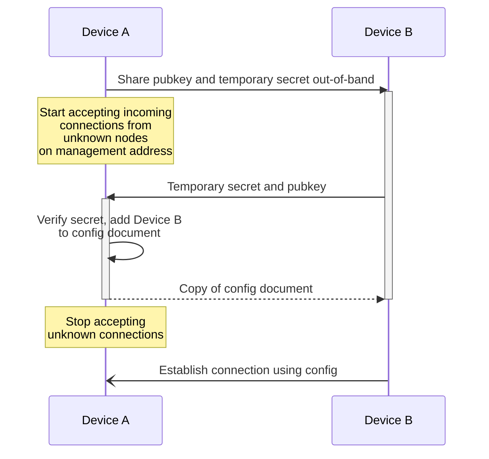

WIP

```mermaid
sequenceDiagram
  Device A->>Device B: Share pubkey and temporary secret out-of-band
  activate Device B
  Note over Device A: Start accepting incoming<br />connections from<br />unknown nodes<br />on management address
  Device B->>Device A: Temporary secret and pubkey
  activate Device A
  Device A->>Device A: Verify secret, add Device B<br />to config document
  Device A-->>Device B: Copy of config document
  deactivate Device A
  deactivate Device B
  Note over Device A: Stop accepting<br />unknown connections
  Device B-)Device A: Establish connection using config
```
